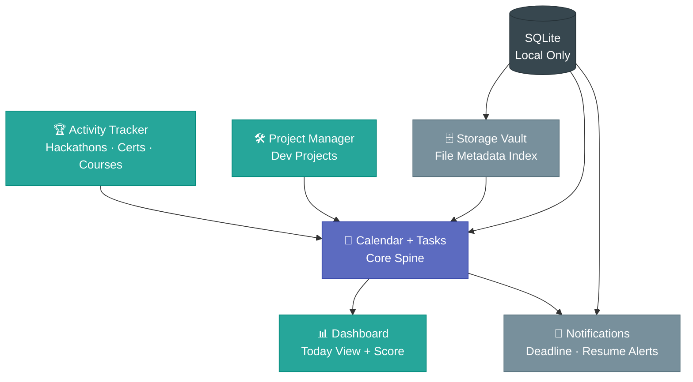
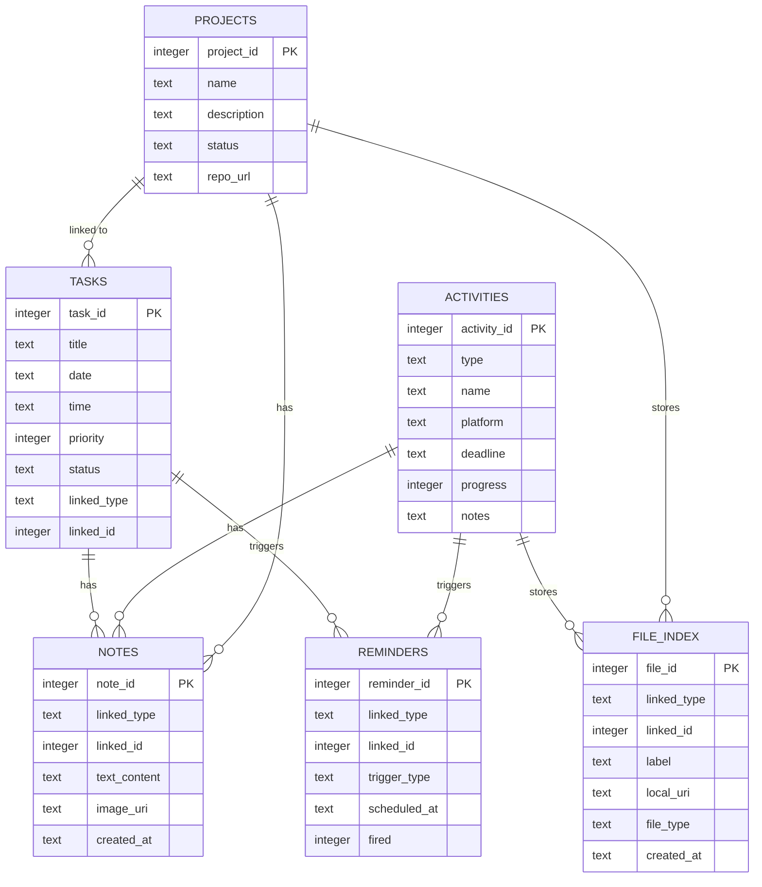
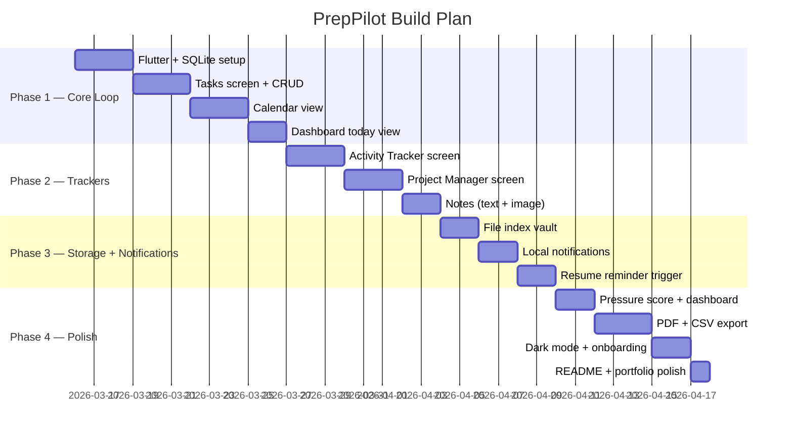

<div align="center">


<br/>

[](https://flutter.dev)
[](https://dart.dev)
[](https://sqlite.org)
[](https://riverpod.dev)
[](LICENSE)
[]()
[]()
[](https://github.com/sangsaist/PrepPilot/stargazers)

<br/>

> **PrepPilot** is a 100% offline, local-first Flutter app that centralizes everything a student needs for placement preparation — tasks, hackathons, certifications, projects, and files — in one focused, minimal interface.

<br/>

[Features](#-features) · [Architecture](#-architecture) · [Database Schema](#-database-schema) · [Tech Stack](#-tech-stack) · [Roadmap](#-roadmap) · [Contributing](#-contributing)

</div>

---

## 🧩 Features

| Module | Description |
|---|---|
| 📅 **Calendar + Tasks** | Central spine of the app. All deadlines, tasks, and activity milestones render as calendar events. |
| 📊 **Dashboard** | Today view with open tasks, active activities, and a live **deadline pressure score**. |
| 🏆 **Activity Tracker** | Single screen for hackathons, certifications, and courses — unified by a `type` field. |
| 🛠 **Project Manager** | Track personal dev projects with tasks linked directly from the tasks table. |
| 🗄 **Storage Vault** | File index that stores metadata + local URIs. No shadow filesystem, no permission hell. |
| 🔔 **Notifications** | Local deadline alerts and resume reminder triggers — all generated on-device. |
| 📄 **PDF Export** | One-page achievement summary: projects, certs, hackathons, open tasks. |
| 📤 **CSV Export** | Export tasks and activities as CSV for external use. |

---

## 🏛 Architecture

PrepPilot follows a **local-first, offline-only** architecture. No network calls. No backend. No cloud dependency.

```
┌─────────────────────────────────────────────────┐
│                  Flutter UI Layer                │
│                                                 │
│   Dashboard  │  Calendar+Tasks  │  Activity     │
│   (Today)    │  (Core Spine)    │  Tracker      │
│              │                  │               │
│   Project    │  Storage Vault   │  Notifications│
│   Manager    │  (File Index)    │  (Local)      │
└──────────────────────┬──────────────────────────┘
                       │ Riverpod Providers
┌──────────────────────▼──────────────────────────┐
│              Repository Layer                    │
│   TaskRepo │ ActivityRepo │ ProjectRepo          │
│   NoteRepo │ FileRepo     │ ReminderRepo         │
└──────────────────────┬──────────────────────────┘
                       │ sqflite DAOs
┌──────────────────────▼──────────────────────────┐
│           SQLite Database (on-device)            │
│  tasks │ activities │ projects │ notes           │
│  file_index │ reminders                          │
└─────────────────────────────────────────────────┘
                       │
┌──────────────────────▼──────────────────────────┐
│           Device File System                     │
│   /files │ /images │ /exports                   │
└─────────────────────────────────────────────────┘
```

### Module Dependency Map



---

## 🗄 Database Schema

All data is stored in a single SQLite database on the device. The schema uses a **polymorphic FK pattern** (`linked_type` + `linked_id`) so notes, files, and reminders attach to any entity without extra join tables.



---

## 🛠 Tech Stack

| Layer | Technology | Purpose |
|---|---|---|
| **UI Framework** | Flutter 3.x | Cross-platform mobile UI |
| **Language** | Dart 3.x | App logic |
| **State Management** | Riverpod | Reactive state, no manual rebuilds |
| **Local Database** | sqflite + path_provider | SQLite on-device storage |
| **Calendar** | table_calendar | Calendar view with event markers |
| **Notifications** | flutter_local_notifications | On-device deadline alerts |
| **File Picker** | file_picker | Attach files to vault |
| **PDF Export** | pdf + printing | Achievement summary export |
| **CSV Export** | share_plus | Share tasks/activities as CSV |
| **Onboarding** | shared_preferences | Store user name, first-launch flag |
| **IDE** | Antigravity IDE | AI-agent assisted development |

---

## 📊 Deadline Pressure Score

The dashboard shows a **pressure score (0–100)** computed from open tasks and upcoming activity deadlines. It is purely local arithmetic — no ML, no API.

```dart
int calcPressureScore(List<Task> tasks, List<Activity> activities) {
  final now = DateTime.now();
  int score = 0;

  for (final t in tasks.where((t) => t.status != 'completed')) {
    final diff = t.date.difference(now).inDays;
    if (diff < 0)      score += 3;  // overdue
    else if (diff == 0) score += 2; // due today
    else if (diff <= 7) score += 1; // due this week
  }

  for (final a in activities) {
    final diff = a.deadline.difference(now).inDays;
    if (diff < 0)      score += 3;
    else if (diff <= 2) score += 2;
    else if (diff <= 7) score += 1;
  }

  return score.clamp(0, 100);
}
```

| Score | Status | Color |
|---|---|---|
| 0 – 20 | All clear | 🟢 Green |
| 21 – 50 | Moderate load | 🟡 Amber |
| 51 – 100 | High pressure | 🔴 Red |

---

## 🗺 Roadmap



---

## 🤖 Antigravity System Prompt

> Copy this into your Antigravity IDE skills/system prompt before starting any agent task.

```
You are working on PrepPilot — a local-first Flutter career preparation app.

STACK:
- Flutter 3.x + Dart 3.x
- State management: Riverpod (flutter_riverpod)
- Database: sqflite + path_provider
- Architecture: feature-first folder structure

ARCHITECTURE RULES:
- Zero network calls. No HTTP, no Firebase, no API of any kind.
- All data lives in SQLite on-device only.
- Use Riverpod providers for all state. No setState except inside isolated widgets.
- Repository pattern: each feature has a repo class that wraps sqflite queries.
- Polymorphic FK pattern: notes, files, reminders use linked_type + linked_id.

SCHEMA (6 tables):
tasks(task_id, title, date, time, priority, status, linked_type, linked_id)
activities(activity_id, type, name, platform, deadline, progress, notes)
projects(project_id, name, description, status, repo_url)
notes(note_id, linked_type, linked_id, text_content, image_uri, created_at)
file_index(file_id, linked_type, linked_id, label, local_uri, file_type, created_at)
reminders(reminder_id, linked_type, linked_id, trigger_type, scheduled_at, fired)

UI RULES:
- Clean minimal Material 3. White backgrounds, #F8F9FA card surfaces.
- Accent color: #5C6BC0 (muted indigo).
- Primary text: #212121. Secondary: #757575.
- Flat outlined cards only — no elevation shadows.
- Bottom nav: 3 tabs only — Home, Track, Plan.

FOLDER STRUCTURE:
lib/
  core/         → database helper, constants, theme
  features/
    dashboard/  → provider, screen, widgets
    tasks/      → model, repo, provider, screen, widgets
    activities/ → model, repo, provider, screen, widgets
    projects/   → model, repo, provider, screen, widgets
    vault/      → model, repo, provider, screen, widgets
    notifications/ → service, rules
  shared/       → common widgets, extensions, utils
```

---

## 🚀 Getting Started

```bash
# Clone the repo
git clone https://github.com/sangsaist/PrepPilot.git
cd PrepPilot

# Install dependencies
flutter pub get

# Run on device or emulator
flutter run
```

**Requirements:** Flutter 3.x · Dart 3.x · Android SDK 21+ or iOS 13+

---

## 🤝 Contributing

Contributions are welcome! Here's how:

1. Fork the repository
2. Create a feature branch: `git checkout -b feature/your-feature-name`
3. Commit your changes: `git commit -m 'feat: add your feature'`
4. Push to the branch: `git push origin feature/your-feature-name`
5. Open a Pull Request

Please follow the existing folder structure and Riverpod patterns when contributing.

---

## 📄 License

This project is licensed under the **MIT License** — see the [LICENSE](LICENSE) file for details.

---

<div align="center">

Built with focus by [sangsaist](https://github.com/sangsaist)


</div>